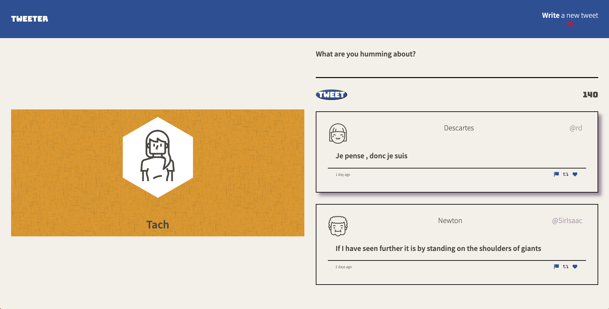
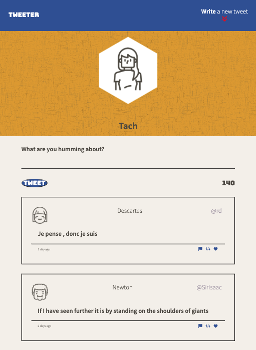
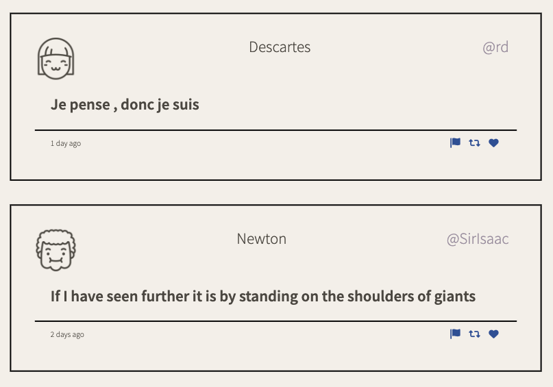
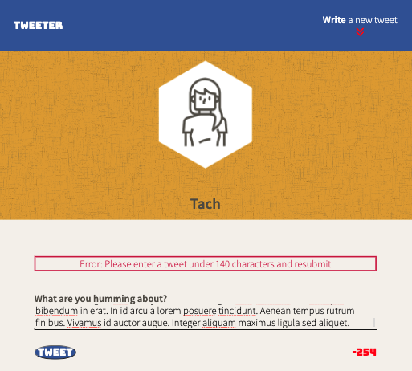

# Tweeter Project
Tweeter is a simple, single-page Twitter clone.

This project was built at part of my studies at Lighthouse Labs. Most of the work done to this was on the front-end, using HTML, CSS, jQuery and AJAX.

## Final Product

## Getting Started

1. Install dependencies using `npm install`
2. Start the web server using the `npm run local` command. The app will be served at <http://localhost:8080/>
4. Go to <http://localhost:8080/> in your browser

## How to Tweet
1. Type in your tweet to the textbox
2. Press submit! 

## Extra info
- If you don't enter text, an error message appears
- If your tweet is too long, an error message appears
- Tweet length can be seen with the character counter in the lower right-hand corner of the box
- Previous tweets are seen below the submit tweet textbox

## Dependencies
- Express
- Node 5.10.x or above
